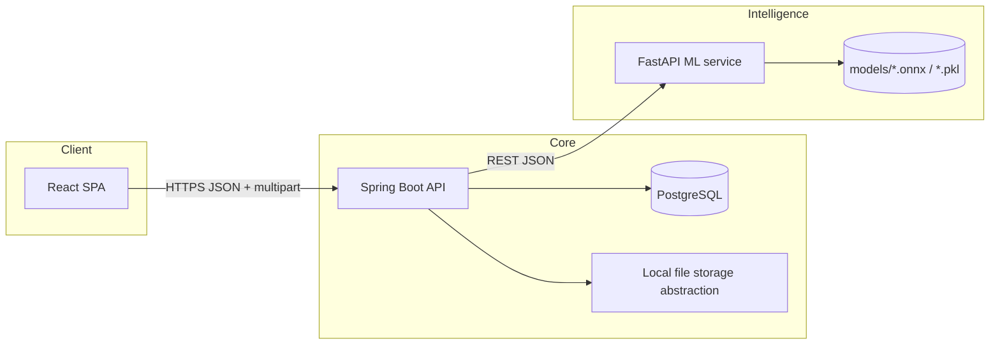
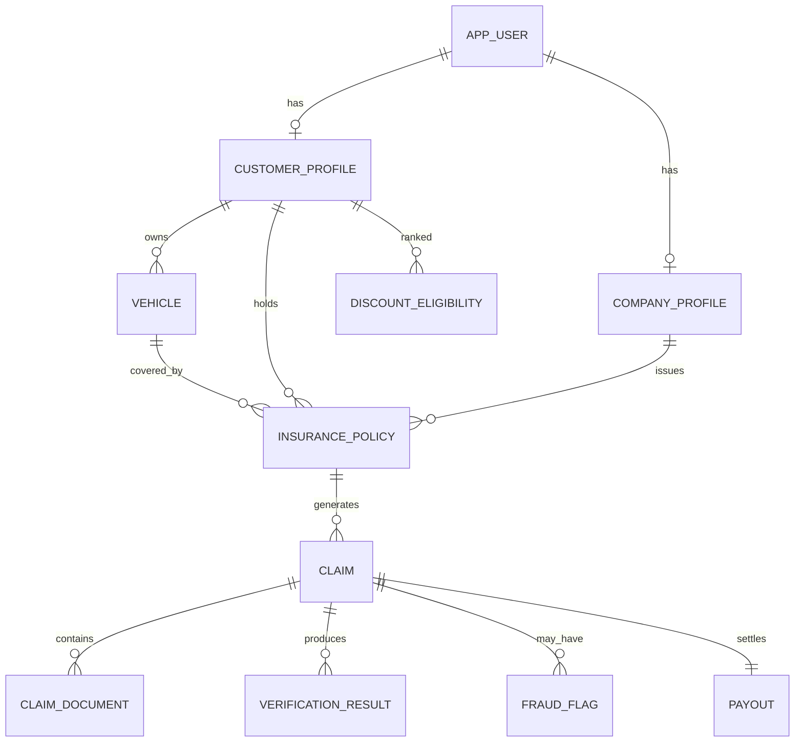

# SmartInsure

Production-style **vehicle-only** insurance claim platform: Spring Boot + JWT security, PostgreSQL, modular Python ML microservice, and a React dashboard tuned for modern insurtech UX.

## Architecture



- **Backend** (`backend/`): layered packages (`controller`, `service`, `repository`, `entity`, `dto`, `security`, `ml`, `storage`, `config`, `exception`). JWT secures `/api/**` with role-based HTTP matchers.
- **ML service** (`ml-service/`): FastAPI app exposing `/ml/*` endpoints that mirror Spring’s `MlServiceClient`. Swap placeholder logic with OpenCV + your saved weights.
- **Frontend** (`frontend/`): Vite + React + Tailwind + Recharts. Proxies `/api` to Spring during development.

## ER diagram (high level)



## Claim lifecycle (sample)

1. Customer authenticates and selects an **active** motor policy.  
2. `POST /api/claims` creates `SUBMITTED`.  
3. Customer uploads Aadhaar, licence, PUC, damage photos → `DOCUMENTS_UPLOADED`.  
4. `POST /api/claims/{claimPublicId}/submit-ai` moves the claim through **AI verification**, calls the Python service for document, fraud, severity, and payout modules, persists `VerificationResult`, creates `Payout`, and queues **manual review** (`MANUAL_REVIEW_PENDING`) unless fraud heuristics flag the case.  
5. Insurer reviews via `POST /api/company/claims/{id}/decision` (`APPROVED`, `REJECTED`, `ADDITIONAL_DOCUMENTS_REQUIRED`).  
6. `POST /api/company/claims/{id}/settle` marks `SETTLED` with a final payout figure.  
7. Customer tracks status via `GET /api/claims/{claimPublicId}` and downloads a TXT summary from `/api/claims/{claimPublicId}/export`.

## Backend package map

```
com.smartinsure
 ├─ config        (Security, CORS, OpenAPI, properties, seeding)
 ├─ controller    (REST adapters)
 ├─ dto           (request/response models)
 ├─ entity        (JPA models + enums)
 ├─ exception     (global error handling)
 ├─ ml            (MlServiceClient + DTOs for Python integration)
 ├─ repository    (Spring Data JPA)
 ├─ security      (JWT filter, user details, password encoder config)
 ├─ service       (domain + orchestration services)
 ├─ storage       (pluggable file storage – local disk default)
 └─ util          (helpers such as claim id generator)
```

## API catalogue (representative)

| Method | Path | Role | Purpose |
| --- | --- | --- | --- |
| POST | `/api/auth/login` | Public | JWT issuance |
| POST | `/api/auth/register/customer` | Public | Customer onboarding |
| POST | `/api/auth/register/company` | Public | Insurer onboarding (pending approval) |
| GET | `/api/public/stats` | Public | Landing metrics |
| GET | `/api/customer/me` | Customer | Profile summary |
| GET/POST | `/api/customer/policies` / vehicles | Customer | Portfolio management |
| GET | `/api/customer/discount` | Customer | Loyalty/discount badge |
| POST | `/api/company/policies` | Company | Issue policy to existing customer + vehicle |
| GET | `/api/company/dashboard` | Company | KPI snapshot |
| POST | `/api/company/claims/{id}/decision` | Company | Manual decision |
| POST | `/api/company/claims/{id}/settle` | Company | Final settlement |
| POST | `/api/claims` | Customer | File claim |
| POST | `/api/claims/{id}/documents` | Customer | Upload evidence |
| POST | `/api/claims/{id}/submit-ai` | Customer | Trigger ML + manual queue |
| GET | `/api/claims` | All (scoped) | Paginated claim inbox |
| GET | `/api/claims/{id}/export` | Authorised | Download TXT summary |
| GET | `/api/search/vehicle` | Admin/Company | Vehicle discovery |
| GET | `/api/discounts/analytics` | Admin/Company | Discount cohort |
| POST | `/api/admin/discounts/recompute` | Admin | Rebuild cohort (top fraction) |
| GET | `/api/admin/dashboard` | Admin | KPI cards |
| GET/POST | `/api/admin/companies*` | Admin | Approvals + bans |
| GET | `/api/admin/fraud/*` | Admin | Fraud intelligence |
| GET | `/api/notifications` | Authenticated | Alerts |

Interactive docs: `http://localhost:8080/swagger-ui/index.html` (Springdoc).

## Frontend routes

| Path | Description |
| --- | --- |
| `/` | Landing |
| `/about` | Product narrative |
| `/login`, `/register/customer`, `/register/company` | Auth flows |
| `/admin` | Admin KPI + pending insurer approvals |
| `/company` | Insurer operations |
| `/customer` | Customer cockpit |
| `/claims/new`, `/claims/:id` | Claim filing + tracking |
| `/fraud` | Admin fraud desk |
| `/search` | Vehicle search (admin/company) |
| `/discounts`, `/discounts/company` | Analytics views |
| `/profile` | Session summary |

## Runbook

### 1. PostgreSQL (local install, no Docker)

Install PostgreSQL 15+ for your OS and start the service.

1. Create a database (names match the default in `application.yml`):

```sql
CREATE DATABASE smartinsure;
```

Use the built-in `postgres` superuser (or any user you prefer) and set `spring.datasource.username` / `password` in `backend/src/main/resources/application.yml` accordingly. On Windows, **pgAdmin** or `psql` from the PostgreSQL `bin` folder is typical.

### 2. ML microservice (optional but recommended)

```bash
cd ml-service
python -m venv .venv
.\.venv\Scripts\activate   # Windows
pip install -r requirements.txt
uvicorn app.main:app --reload --port 8090
```

Set `smartinsure.ml-service.enabled=false` in `application.yml` to force deterministic placeholders without Python.

### 3. Spring Boot API

```bash
cd backend
mvn spring-boot:run
```

Requires **Java 17** + **Maven** on `PATH`. The `dev` profile (default) seeds demo users:

| Email | Password | Role |
| --- | --- | --- |
| `admin@smartinsure.com` | `Admin@123` | Admin |
| `digit@insurer.com` | `Company@123` | Approved insurer |
| `acko@insurer.com` | `Company@123` | Pending insurer (cannot login) |
| `ravi@customer.com` | `Customer@123` | Customer w/ vehicle `KA03MN4455` |

### 4. React client

```bash
cd frontend
npm install
npm run dev
```

Visit `http://localhost:5173`. The dev server proxies `/api` to Spring.

## Where to place ML artefacts

1. Copy weights into `ml-service/models/` (see `models/.gitkeep`).  
2. Update the corresponding function in `ml-service/app/main.py` (or split into `document_verification_service.py`, `damage_severity_service.py`, etc.).  
3. Keep artefacts on disk under `ml-service/models/`; the FastAPI process reads from that path when you add loaders.  
4. Spring Boot reads `smartinsure.ml-service.base-url` to locate the Python service.

## Spring ↔ Python call flow

1. Customer hits `submit-ai`.  
2. `ClaimService.runAiPipeline` builds lightweight JSON payloads (claim ids, counts, sum insured).  
3. `MlServiceClient` posts to `/ml/document-verification`, `/ml/fraud-detection`, `/ml/damage-severity`, `/ml/payout-estimation`.  
4. Responses are persisted as `VerificationResult` rows for traceability.  
5. When Python is offline, the client logs a warning and uses safe fallbacks so demos keep working.

## Hardening checklist for real deployments

- Rotate JWT secret & move to vault.  
- Move uploads to S3-compatible storage implementing `FileStorageService`.  
- Tighten CORS origins.  
- Add Flyway migrations instead of relying solely on `ddl-auto`.  
- Wire real OCR/OpenCV + model inference pipelines and GPU workers.  
- Add integration tests for claim transitions and security rules.

---

SmartInsure is intentionally modular so hackathon judges (and hiring managers) can see clean boundaries between **domain services**, **security**, **integrations**, and **presentation**.
